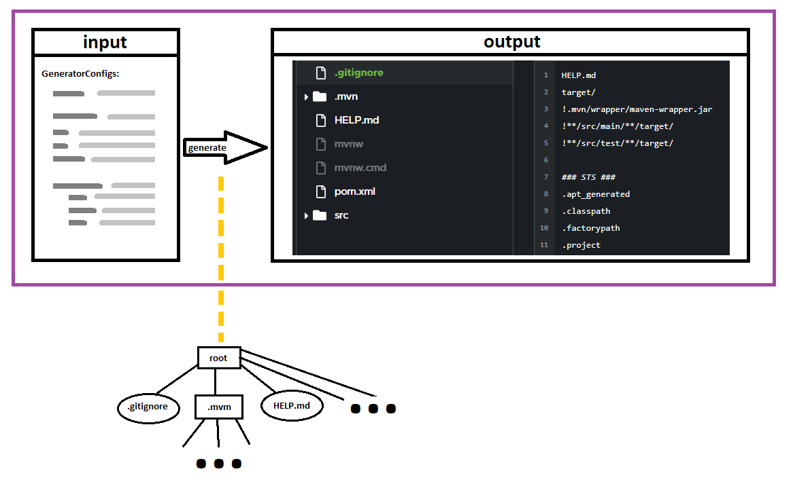
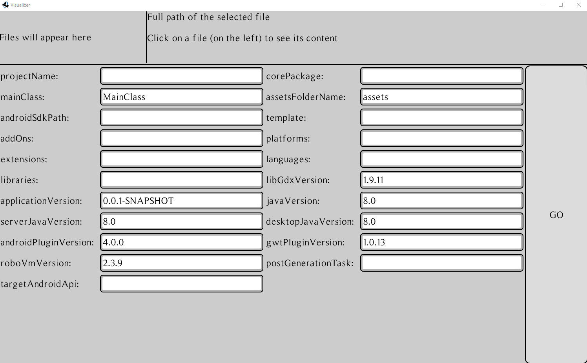

# API
A "consuming" application should only mostly interact with ``Generator#generateFileStructure``:
* Input is ``GeneratorConfigs``.
* Ouput is ``GeneratedProject``.
* The ``VirtualFileSystem`` class is a custom tree (data structure) implementation. The root is obtained via ``#getRoot()``. All nodes of the tree are ``FileNode``, and navigation happens through those (via ``#getChildren()``).

In this way, the logic's internals are completely hidden from the user.

## Using the output
The ``GeneratedProject`` contains a possible error message, and a virtual file structure.

// todo: implement Visitor pattern and finish this documentation

# Tests
IntelliJ Run Configurations are provided out-of-the-box with the repository.

You can use those to test the implementation of the generator in different aspects:

## ``Run tests``
Automated tests are part of the development process but also integrated in the CI pipeline.

After any major changes, you can quickly test if some fundamental parts of the generator were affected.

## ``Visualizer``
To help with quickly reviewing the content of the generated output according to different input, a GUI application has been set up in the ``test`` folder.

Below is a sketch of the basic idea, followed by a gif of the alpha version of an implementation.

# liftoff
This is an effort to extract the logic from the [``liftoff``](https://github.com/tommyettinger/gdx-liftoff) project which couples the Model and the View together.

For the most part, the underlying parts of the logic remained the same.

Differences:
* One of the key differences is that instead of generating the project by going from one input-option to the next (which was the natural choice for an approach using ``LML-MVC``), this rather focuses the generation on each separated file.
As an example, ``liftoff`` had a class which took the "Kotlin Language Option" and acted on the properties of the different other components affected by that choice.
This current project instead focuses on specific generated files instead: thus, the "Kotlin Language Option" configuration is observed within the class which takes care of generating the ``android`` module's ``build.gradle`` file (and all other files related, separately).
While this file-oriented approach breaks a few software engineering principles, I feel like it's a more natural way of interacting with the code: it's easier to think of our desires in terms of the convention-based generated file structure rather than in terms of the arbitrarily-structured input.
* As a corollary, it's easier to maintain the code because a file's content is always completely determined at its instantiation, rather than spanning through different classes' processes.
* Possibility to recursively copy the content of a folder in the ``resources``.
* Another interesting difference is the existence of "dynamic files": instead of having text-blocks in the code, certain files are part of the resources and include "keys" at specific places which are to be dynamically replaced in the code.
* Moreover, the project was ported from Kotlin to Java to increase maintainability on the long-term (as not everyone knows Kotlin). The secondary goal is to facilitate an eventually GWT-compatible version.

## GWT

For GWT-compatibility, this needs to be changed:

* ``FileUtils#readResourceFile`` uses a ClassLoader
* ``FileUtils#replaceResourceFileContent`` uses a Regex
* ``StringUtils#keepAlphaNumerics`` uses a Regex
* ``LibGdxVersion#transform`` uses a Regex
* ``BuildGradleFile#getDependencyString`` uses a Regex

Once the project is GWT-compatible, it should be possible to generate a file structure directly from a frontend.

# Concerns

The replacement algorithm used for generating content dynamically from static files has a vulnerability.

It needs to check if the input text doesn't contain a key to avoid a "recursive" call which would explode the memory.

The fix is easy to integrate, but for now this project is a MVP (Minimal Viable Product).

# Documentation

// todo... see: https://discordapp.com/channels/348229412858101762/522048465736433664/760021122217148466